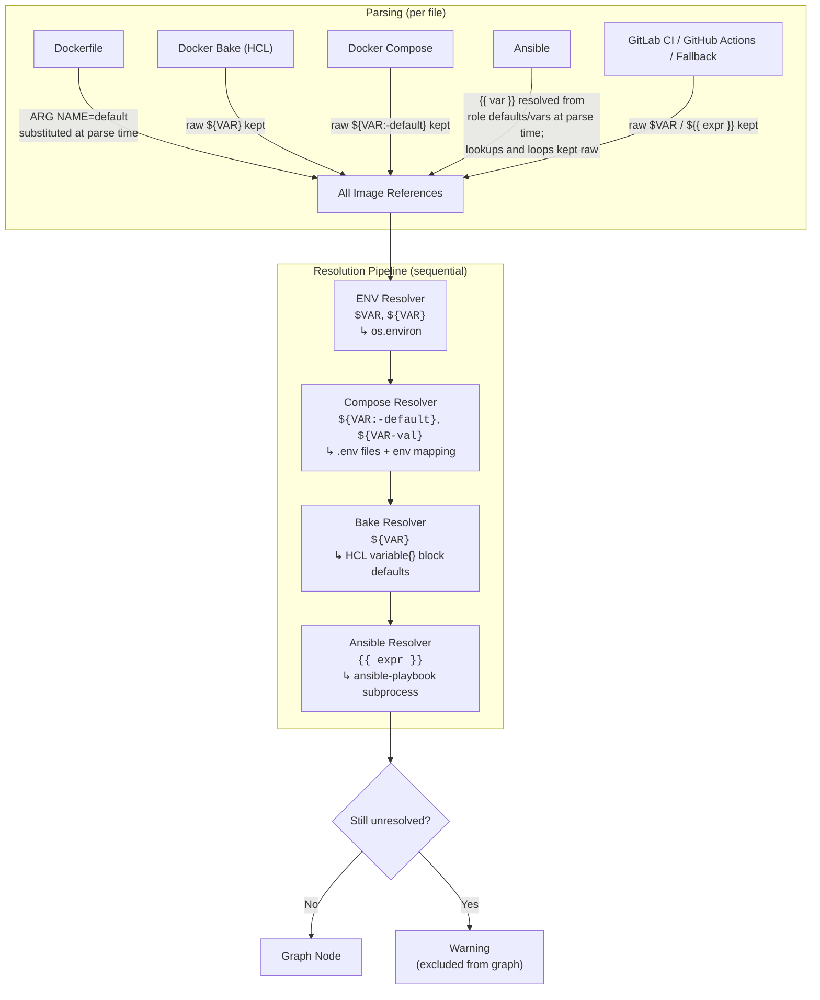

# Shipwreck

[](https://github.com/ozonejunkieau/shipwreck/actions/workflows/ci.yml)
[](https://github.com/ozonejunkieau/shipwreck)
[](https://www.python.org/downloads/)
[](LICENSE)
[](https://claude.ai)

**Map your Docker image dependencies before they sink you.**

Docker images form invisible dependency graphs across repositories. When a base image changes, you need to know what builds from it, what deploys it, and whether anything is running a stale version. Shipwreck scans your Git repositories, parses every file that references a Docker image, builds a complete dependency graph, and generates interactive HTML reports, Mermaid diagrams, and machine-readable JSON.

> This project was built almost entirely with [Claude](https://claude.ai) (Anthropic's AI assistant) using [Claude Code](https://claude.ai/claude-code). The architecture, implementation, tests, and documentation were developed through iterative AI-assisted programming.

---

## Quick Start

```bash
git clone https://github.com/ozonejunkieau/shipwreck.git
cd shipwreck
uv sync --all-extras

# Scan the bundled examples — no remote repos needed
shipwreck hunt --config examples/shipwreck-examples.yaml -o examples/output

# Generate an interactive HTML report
shipwreck map --config examples/shipwreck-examples.yaml -o examples/output --format html
open examples/output/shipwreck.html
```

Reports are written to `.shipwreck/output/` by default. The examples use `-o examples/output` to keep generated files alongside the example data.

### Try the bundled examples

The `examples/` directory contains a complete set of sample data covering every parser — Dockerfiles, Docker Bake (HCL), Docker Compose, and Ansible playbooks — so you can see Shipwreck in action without any configuration of your own.

```bash
# Scan all example data and generate reports in one shot
shipwreck sail --config examples/shipwreck-examples.yaml -o examples/output

# Just scan, then explore the graph interactively
shipwreck hunt --config examples/shipwreck-examples.yaml -o examples/output
shipwreck dig --stale          # list stale images
shipwreck dig --critical       # rank images by criticality
shipwreck dig --uses postgres  # what depends on postgres?

# Generate specific output formats
shipwreck map --config examples/shipwreck-examples.yaml -o examples/output --format html
shipwreck map --config examples/shipwreck-examples.yaml -o examples/output --format mermaid
shipwreck map --config examples/shipwreck-examples.yaml -o examples/output --format json
```

The example config ([`examples/shipwreck-examples.yaml`](examples/shipwreck-examples.yaml)) uses local paths, so nothing is cloned or fetched. The example data includes:

| Directory | Parser | What it shows |
|---|---|---|
| [`examples/dockerfiles/`](examples/dockerfiles/) | Dockerfile | `FROM` chains, internal base images |
| [`examples/bake/`](examples/bake/) | Docker Bake | HCL variables, target inheritance, `docker-image://` contexts |
| [`examples/compose/`](examples/compose/) | Docker Compose | `${VAR:-default}` substitution, `.env` resolution, `build` + `image` |
| [`examples/ansible/`](examples/ansible/) | Ansible | Role defaults, Jinja2 templates, `block`/`rescue`, loop vars, lookups |

To scan your own repos, copy [`examples/shipwreck-minimal.yaml`](examples/shipwreck-minimal.yaml) and point `repositories:` at your Git URLs or local paths. See [`examples/shipwreck.yaml`](examples/shipwreck.yaml) for every available option.

---

## Commands

### `hunt` -- Scan repos for image references

Clones or pulls the configured repositories, runs all parsers, builds the dependency graph, and caches it for `map`.

```
shipwreck hunt [OPTIONS]

Options:
  -c, --config PATH          Config file (default: shipwreck.yaml)
  --cache-dir PATH           Where to cache cloned repos (default: .shipwreck/repos)
  --no-pull                  Use cached repos as-is, skip git pull
  --include-repo TEXT        Only scan these repos (repeatable)
  --exclude-repo TEXT        Skip these repos (repeatable)
  --snapshot                 Save a timestamped snapshot after scanning
  -o, --output PATH          Output directory (default: .shipwreck/output)
```

### `map` -- Generate dependency reports

Generates the full dependency graph in one or more output formats from the most recent `hunt` result (or re-scans if no cached graph exists).

```
shipwreck map [OPTIONS]

Options:
  -c, --config PATH          Config file (default: shipwreck.yaml)
  -o, --output PATH          Output directory (default: .shipwreck/output)
  --format TEXT              Output format: html, mermaid, json, or all (default: all)
  --snapshot                 Also save a timestamped snapshot
  --mermaid-per-repo         Generate per-repo Mermaid subgraphs
  --diff-from PATH           Previous snapshot JSON -- overlay diff in the report
```

### `dig` -- Query the graph

Query graph metadata from the command line. Defaults to showing a summary if no filter is given.

```
shipwreck dig [OPTIONS]

Options:
  -s, --snapshot PATH        Snapshot JSON to query (default: latest)
  --uses IMAGE               What images/repos use this image?
  --used-by IMAGE            What does this image depend on?
  --stale                    List all stale images
  --critical                 List images ranked by criticality score
  --classify CLASS           Filter by classification
  --format TEXT              Output format: json, text, table (default: table)
```

### `lookout` -- Check registries for staleness

Queries configured registries and enriches the graph with staleness data (current, behind, major_behind, unknown).

```
shipwreck lookout [OPTIONS]

Options:
  -c, --config PATH          Config file (default: shipwreck.yaml)
  -s, --snapshot PATH        Existing snapshot to enrich with registry data
  --registry NAME            Only check this registry (default: all configured)
  --include-external         Also check external registries
  --yes                      Skip external registry approval prompts (CI mode)
  -o, --output PATH          Output directory (default: .shipwreck/output)
```

### `log` -- Compare snapshots

Compares two snapshots and shows what changed: added/removed images, version bumps, staleness changes.

```
shipwreck log [OPTIONS]

Options:
  --before PATH              Previous snapshot JSON
  --after PATH               Current snapshot JSON (default: latest)
  -o, --output PATH          Output diff report path
  --format TEXT              Output format: json, text, table (default: table)
```

### `plunder` -- Discover repos from GitLab

Queries a GitLab group and returns all project SSH/HTTPS URLs. Can append them directly to your config file.

```
shipwreck plunder [OPTIONS]

Options:
  --url TEXT                 GitLab instance URL
  --group TEXT               Group path (e.g. "my-org/containers")
  --token-env TEXT           Env var holding the access token (default: GITLAB_TOKEN)
  --include-subgroups        Include nested subgroups
  --include-pattern TEXT     Regex include filter on project paths
  --exclude-pattern TEXT     Regex exclude filter on project paths
  --dry-run                  List discovered repos without writing anything
  --append-config PATH       Append discovered repos to a config file
```

### `sail` -- Full pipeline

Runs `hunt`, `lookout`, and `map` in sequence. Intended for cron jobs and CI pipelines.

```
shipwreck sail [OPTIONS]

Options:
  -c, --config PATH          Config file (default: shipwreck.yaml)
  -o, --output PATH          Output directory (default: .shipwreck/output)
  --snapshot                 Save a timestamped snapshot after the run
  --diff-from-latest         Auto-diff against the most recent existing snapshot
  --yes                      Non-interactive mode (skips all prompts)
```

CI usage:

```bash
shipwreck sail -c shipwreck.yaml --snapshot --diff-from-latest --yes
```

---

## Parsers

Shipwreck runs 7 parsers in priority order. The fallback only processes files not claimed by a specific parser.

| Parser | Files matched | Edge types |
|---|---|---|
| Dockerfile | `Dockerfile`, `Dockerfile.*`, `*.dockerfile` | `builds_from` |
| Docker Bake | `docker-bake.hcl`, `docker-bake.override.hcl` | `produces`, `builds_from` |
| Docker Compose | `compose.yaml`, `docker-compose.yml`, variants | `consumes`, `produces` |
| GitLab CI | `.gitlab-ci.yml`, `*.gitlab-ci.yml`, `.gitlab-ci/` | `consumes`, `produces` |
| GitHub Actions | `.github/workflows/*.yml` | `consumes`, `produces` |
| Ansible | `tasks/`, `roles/`, `handlers/` directories | `consumes` |
| Fallback | Unclaimed `.yml`/`.yaml`, `Containerfile` | `consumes`, `builds_from` |

See [PARSERS.md](PARSERS.md) for full parser specifications.

### Edge types

| Edge | Meaning | Report label | Example |
|---|---|---|---|
| `builds_from` | Dockerfile `FROM` or bake `contexts` | builds_from | `myapp:1.0` depends on `python:3.12-slim` |
| `produces` | A build file outputs this image | produces | `docker-bake.hcl` produces `myapp:0.2.0` |
| `consumes` | A deployment file references this image | requires | `docker-compose.yml` requires `postgres:16` |

In the interactive HTML report, `consumes` edges are displayed with reversed direction and labelled "requires" for readability -- the arrow points from consumer to dependency.

### Image classifications

| Class | Description | Visual |
|---|---|---|
| `base` | Internal base images, built from external sources | Grey badge |
| `application` | Application images built and deployed | Blue badge |
| `middleware` | Infrastructure services (databases, caches) | Purple badge |
| `utility` | Operational tooling and helpers | Green badge |
| `external` | Third-party images from public registries | Orange badge, dashed border |
| `test` | Test and CI-only images | Amber badge, dashed border |
| `unknown` | Unclassified | Dim badge |

Classification is overridable via path/image pattern rules in config.

---

## Version Schemes

Configurable per image via `version_schemes` in the config. The first matching `image_pattern` wins.

| Scheme | Ordering logic | Example tags |
|---|---|---|
| `semver` | Standard semver comparison, leading `v` stripped | `1.2.3`, `v0.1.0-rc1` |
| `numeric` | Integer or float comparison | `1709251200`, `42` |
| `date` | Parsed date comparison, configurable `format` | `20250227`, `2025-02-27` |
| `regex` | Extract a substring, compare with an inner scheme | `v1.2.3-alpine` -> `1.2.3` -> semver |

**Staleness thresholds:**

| Status | Condition |
|---|---|
| `current` | Referenced tag matches the latest available |
| `behind` | Behind latest, same major version (semver) or within threshold |
| `major_behind` | Different major version or beyond threshold |
| `unknown` | Tag not found in registry, or version cannot be parsed |

---

## Configuration

Shipwreck is configured via a YAML file (default: `shipwreck.yaml`). See [examples/shipwreck.yaml](examples/shipwreck.yaml) for a fully annotated example.

```yaml
registries:
  - name: internal
    url: registry.example.com
    auth_env: REGISTRY_AUTH_TOKEN
    internal: true

repositories:
  - url: git@gitlab.example.com:infra/base-images.git
    ref: main
  - path: /local/path/to/repo
    name: local-project

# Auto-discover repos from GitLab
discovery:
  - type: gitlab_group
    url: https://gitlab.example.com
    group: my-org/containers
    auth_env: GITLAB_TOKEN
    include_subgroups: true

# Version comparison schemes
version_schemes:
  - image_pattern: "registry.example.com/wolfi/*"
    type: numeric
  - image_pattern: "*"
    type: semver

# Image classification overrides
classification:
  rules:
    - path_pattern: "**/test/**"
      class: test
    - image_pattern: "registry.example.com/base/*"
      class: base
```

---

## Architecture

```
src/shipwreck/
├── cli.py              # Typer commands (hunt, map, dig, lookout, log, plunder, sail)
├── config.py           # Pydantic config models
├── models.py           # Graph, GraphNode, GraphEdge, ImageReference
├── scanner.py          # Orchestrator: clone + parse + build graph
├── parsers/            # dockerfile, bake, compose, ansible, gitlab_ci, github_actions, fallback
├── registry/           # Registry HTTP v2 client, staleness detection, version schemes
├── resolution/         # Ansible playbook generation, env var and bake/compose variable resolution
├── graph/              # Builder, alias resolution, classifier, criticality scoring
├── discovery/          # GitLab group discovery
├── output/             # HTML (Jinja2), Mermaid, JSON export, snapshot diff
└── query/              # Query engine backing the dig command
```

The pipeline runs in five stages:

1. **Scan** (`hunt`) -- Clone/pull repos, walk files, assign each to a parser by filename
2. **Parse** -- Extract `ImageReference` objects with edge types, confidence, source locations
3. **Resolve** -- Substitute ARG defaults, HCL/Compose variables, CI variables, Ansible templates
4. **Build graph** -- Deduplicate nodes, apply aliases, compute criticality, classify
5. **Output** (`map`) -- Interactive HTML report, Mermaid diagram, or JSON metadata

### Variable Resolution

Each parser extracts raw image strings that may contain template variables. Some
parsers resolve variables inline (Dockerfile `ARG` defaults, Ansible role
`defaults/main.yml`); the rest are resolved by a sequential pipeline of
resolvers that each handle a specific variable syntax.



**What each resolver can resolve:**

| Resolver | Syntax | Source | Example |
|---|---|---|---|
| Parser (Dockerfile) | `$VAR`, `${VAR}` | `ARG` defaults in the same file | `ARG BASE=python:3.12` → `FROM $BASE` |
| Parser (Ansible) | `{{ var }}` | Role `defaults/main.yml`, `vars/main.yml` | `{{ nginx_version }}` → `1.27.3` |
| ENV | `$VAR`, `${VAR}` | `os.environ` (opt-in via `resolve_env_vars: true`) | `${REGISTRY}` from shell env |
| Compose | `${VAR:-default}` | `.env` files, env mapping in config | `${TAG:-latest}` → `latest` |
| Bake | `${VAR}` | HCL `variable { default = "..." }` blocks | `${REGISTRY}/app` from bake file |
| Ansible | `{{ var }}` | Play-level vars, inventory, extra-vars | `{{ internal_registry }}/app` |
| Ansible | `{{ lookup('file', ...) }}` | File contents via `ansible-playbook` | `{{ lookup('file', 'version.txt') }}` |
| Ansible | `{{ item.x }}` + `loop:` | Loop expansion via `ansible-playbook` | Unrolled to one ref per item |

**What remains unresolvable** (reported as warnings):

- Ansible `{{ lookup('hashi_vault', ...) }}` -- requires vault access at scan time
- Ansible play-level `vars:` without inventory context
- Dynamic loop sources (`loop: "{{ some_var | default([]) }}"`)
- CI runtime variables (`$CI_COMMIT_SHA`, `$GITHUB_SHA`)

---

## Development

```bash
git clone https://github.com/ozonejunkieau/shipwreck.git
cd shipwreck
uv sync --all-extras

just test        # run all tests (612 tests)
just test-unit   # unit tests only
just test-int    # integration tests only
just lint        # ruff check
just fmt         # ruff format
just check       # basedpyright type check
just coverage    # pytest with coverage report (88%+)
just all         # lint + check + test
```

Requirements: Python 3.12+, [uv](https://docs.astral.sh/uv/), [just](https://github.com/casey/just).

### Generate a report from example data

```bash
shipwreck sail --config examples/shipwreck-examples.yaml -o examples/output
open examples/output/shipwreck.html
```

Or generate a hardcoded demo graph (no parsing, useful for UI development):

```bash
uv run python scripts/generate_demo.py
open demo_output/shipwreck.html
```

---

## License

[MIT](LICENSE)
